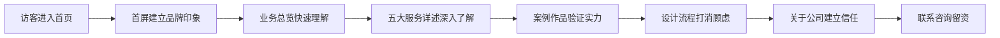

# 森呼吸庭院设计 — 产品需求文档（PRD）

## 1. 产品概述

「森呼吸庭院设计」是一家专注于户外庭院与花箱景观的设计公司，提供从花箱定制、绿植售卖、现场搭建到庭院整体设计与施工的一站式服务。本网站为公司官方形象站，目标是建立专业、可信、有审美的品牌印象，向潜在客户（别墅业主、商业门店、市政/物业方）清晰传达业务能力与过往作品。

- 目标用户：别墅/私院业主、商业门店外摆方、小区/物业绿化负责人、市政景观采购方
- 价值定位：用有温度的东方造园审美 + 标准化施工落地能力，替代市面上千篇一律的成品花箱与模板化庭院方案
- 网站定位：单页 + 多锚点导航的静态官网，桌面优先，移动端自适应

## 2. 核心功能

### 2.2 功能模块

1. **首页（单页长滚动）**：品牌首屏 → 业务总览 → 五大服务 → 案例作品 → 设计流程 → 关于公司 → 联系咨询
2. **顶部导航**：锚点跳转 + 顶部联系方式
3. **底部备案信息**：公司名、联系方式、版权

### 2.3 页面详情

| 页面名称 | 模块名称 | 功能描述 |
|---------|---------|---------|
| 首页 | 品牌首屏 Hero | 大图 + 公司名「森呼吸庭院设计」+ slogan「让每一寸户外，都有呼吸的节奏」+ 双 CTA（查看案例 / 咨询定制）|
| 首页 | 业务总览 | 五大服务图标式概览，hover 显详情 |
| 首页 | 五大服务详述 | 锚点分段，每段：编号 + 服务名 + 长描述 + 要点列表 + 配图 |
| 首页 | 案例作品 | 网格瀑布流，hover 显示项目名/类型/材质标签 |
| 首页 | 设计流程 | 6 步流程：勘测 → 沟通 → 方案 → 效果图 → 施工 → 养护 |
| 首页 | 关于公司 | 公司理念、服务保障、数据亮点（年限/案例数/材质种类）|
| 首页 | 联系咨询 | 联系方式 + 咨询表单（仅前端）+ 服务区域 |
| 全局 | 顶部导航 | 锚点跳转，滚动时背景渐显 |
| 全局 | 底部信息 | 公司全称、电话、地址、版权、备案占位 |

## 3. 核心流程

访客进入 → 浏览首屏建立品牌印象 → 滚动查看服务能力 → 查看案例作品验证实力 → 了解流程打消顾虑 → 跳转联系咨询留资。

## 4. 用户界面设计

### 4.1 设计风格

**整体调性：东方禅意 × 现代克制 × 自然质感**，避免任何"AI 模板感"。

- **主色系**：
  - 主背景：米白宣纸色 `#F5F1EA` / `#EFEAE0`
  - 深色文本：墨绿黑 `#1F2A24` / `#2C3530`
  - 强调色：苔藓绿 `#5B6B4E`、竹青 `#8FA777`
  - 点缀色：赭石 `#A86B3C`、暖陶 `#C98A5C`
- **辅色**：原木褐 `#7A5B3D`、雾灰 `#B8B2A7`
- **字体**：
  - 中文标题：思源宋体（Noto Serif SC）— 有书卷气，区别于常见黑体
  - 中文正文：思源黑体（Noto Sans SC）Light/Regular
  - 西文/数字：Cormorant Garamond（衬线显示字）+ Inter（正文）
- **按钮风格**：细描边 + 直角微圆（2px），克制不张扬；hover 时填充色反转
- **布局**：大量留白 + 非对称构图 + 编号引导（一、二、三），杂志式分栏
- **图标/装饰**：手绘风线稿植物 SVG、印章式编号、细线分隔、纸质纹理底
- **图片风格**：自然光庭院实景，避免摆拍感；统一低饱和度调色

### 4.2 页面设计概览

| 页面名称 | 模块名称 | UI 元素 |
|---------|---------|---------|
| 首页 | 品牌首屏 | 全屏庭院背景图 + 暗色蒙层 + 居左竖排大标题「森呼吸」+ 副标题 + 滚动指引 |
| 首页 | 业务总览 | 五个等分列，每列：线稿图标 + 序号 + 服务名 + 一句话 |
| 首页 | 服务详述 | 左右交替分栏：一侧大图，一侧编号+标题+长描述+要点（带·符号）|
| 首页 | 案例作品 | 3 列不等高网格，hover 遮罩显示项目信息与标签 |
| 首页 | 设计流程 | 横向 6 步时间轴，细线连接，编号 + 标题 + 描述 |
| 首页 | 关于公司 | 左侧理念长文 + 右侧数据竖排（年限/案例/材质/区域）|
| 首页 | 联系咨询 | 左侧表单（姓名/电话/需求类型/留言）+ 右侧联系方式 + 服务区域文字 |
| 全局 | 顶部导航 | 透明→滚动后白底，左 logo 右锚点菜单 + 电话按钮 |
| 全局 | 底部 | 米色底，三栏：公司信息 / 快速导航 / 联系方式 + 版权条 |

### 4.3 响应式

- 桌面优先（≥1200px 完整双栏布局）
- 平板（768–1199px）：双栏折叠为单栏，案例网格变 2 列
- 移动（<768px）：单栏纵向，导航折叠为汉堡菜单，首屏高度自适应，字号下调
- 触控优化：按钮命中区域 ≥44px，hover 效果在触控设备降级为常显

### 4.4 3D 场景

本项目不使用 3D 场景，采用静态摄影 + CSS 视差 + 滚动渐显营造空间感。

## 5. 内容素材策略

- 所有图片使用 `console.enterprise.trae.cn` 文生图接口生成，prompt 围绕「自然光下的中式庭院、花箱景观、绿植特写」，统一低饱和度调色
- 案例作品使用虚构但合理的项目名（如「云栖·和庄私院」「外滩源门店外摆」「临港市政花箱组团」）
- 数据亮点使用合理区间值，避免夸大
