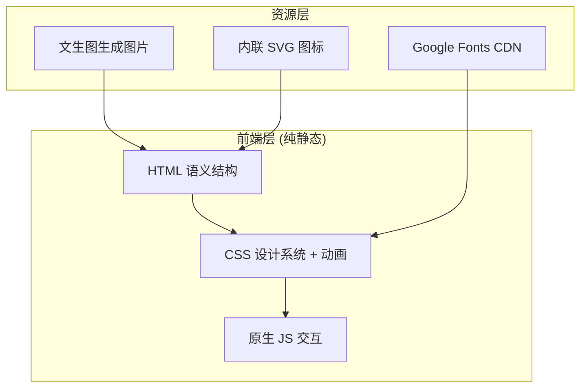

# 森呼吸庭院设计 — 技术架构文档

## 1. 架构设计

纯前端静态官网，无后端、无数据库、无外部 API。所有内容静态渲染，联系表单仅前端校验与提示，不实际提交。



## 2. 技术选型

- **前端**：原生 HTML5 + CSS3 + 原生 JavaScript（ES6+），无构建工具、无框架
  - 理由：单页静态官网，内容固定，无需 React/Vue 的组件化与状态管理；原生实现更轻量、首屏更快、可双击直接打开
- **字体**：Google Fonts CDN 引入 Noto Serif SC / Noto Sans SC / Cormorant Garamond / Inter
- **图片**：全部通过 `console.enterprise.trae.cn` 文生图接口生成，本地无图片资源
- **图标**：内联手绘风线稿 SVG
- **初始化工具**：无（手写单文件）
- **后端**：无
- **数据库**：无

## 3. 路由定义

单文件 `index.html`，通过锚点实现单页内导航：

| 锚点 | 目的 |
|------|------|
| `#top` | 顶部首屏 |
| `#services` | 业务总览 |
| `#service-detail` | 五大服务详述 |
| `#cases` | 案例作品 |
| `#process` | 设计流程 |
| `#about` | 关于公司 |
| `#contact` | 联系咨询 |

## 4. 文件结构

```
d:\workspace\tools\senhuxi-website\
├── index.html        # 单文件包含全部 HTML 结构
├── styles.css        # 全部样式（设计系统 + 组件 + 响应式）
└── script.js         # 交互：导航、滚动显隐、表单校验、案例筛选
```

## 5. 性能与可访问性

- 字体使用 `display=swap` 避免阻塞渲染
- 图片使用 `loading="lazy"`（首屏除外）
- 所有图标配 `aria-label`，表单字段配 `label`
- 颜色对比度满足 WCAG AA
- 滚动监听使用 `requestAnimationFrame` 节流

## 6. 交互清单

- 顶部导航：滚动超过 80px 后背景由透明转白底带阴影
- 移动端汉堡菜单：点击展开/收起，点击锚点后自动收起
- 滚动渐显：各内容块进入视口时淡入上移（IntersectionObserver）
- 案例作品：hover 遮罩显示项目信息；移动端常显
- 联系表单：前端校验姓名非空、电话格式、需求类型已选，提交后显示成功提示
- 首屏滚动指引：呼吸式上下浮动动画
